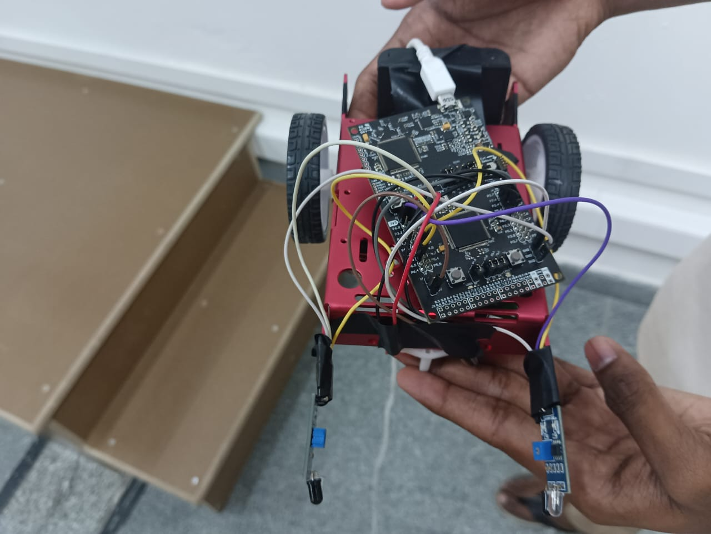

# Obstacle Avoidance Rover

## Description
This project showcases a simple obstacle avoidance rover built using an MSP432 board in C. The rover utilizes infrared (IR) sensors to detect obstacles and navigate around them. The code provided is self-explanatory and easy to edit according to your requirements.

## How to Use
1. Connect the MSP432 board to the necessary components, including the motors, IR sensors, and power source.
2. Upload the provided code to the MSP432 board.
3. Ensure that the pin configurations in the code match the connections on your setup. Pin configurations are declared using BIT notation.
   - For example, to declare pin P2.2 as an output, use `P2->SEL0 &= ~BIT2`.
4. Once the code is uploaded and connections are verified, power on the rover.

## Pin Configuration
- Modify the pin numbers in the code to match your setup if necessary.
- Pins are declared using BIT notation.
- Example: `P2->SEL0 &= ~BIT2` represents pin 2 in port 2.

## Components Used
- MSP432 board
- Motors
- IR sensors
- Power source

## Reference
- [Video: Obstacle Avoidance Rover in Action](video_link_here)
- 

## Video
[

## Image

Feel free to modify and enhance the project as needed!
